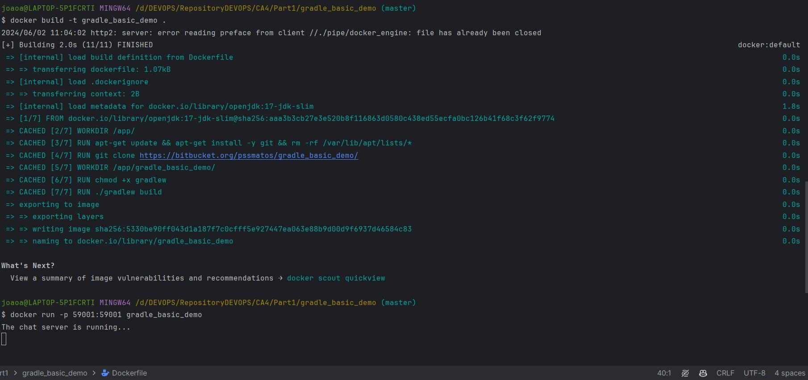
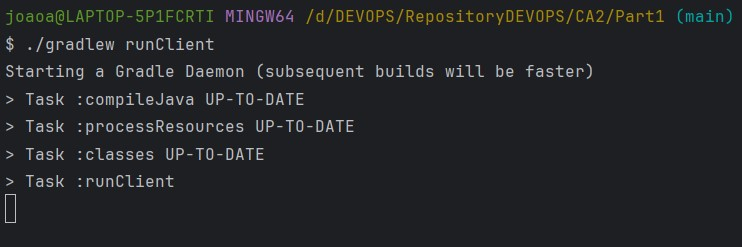
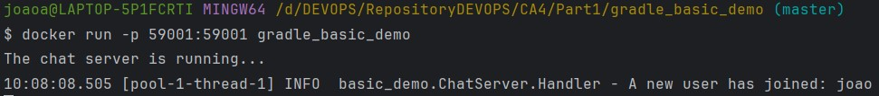
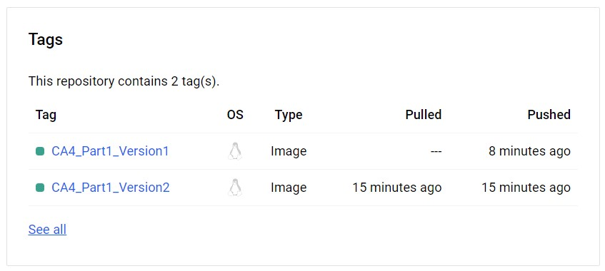

# Class Assignment 4 Part 1 - DEVOPS - João Vieira 1231835 SWitCH

## Introduction

In this class assignment the aim was to use Docker to create an image and run a container with that image.
Two dockerfiles were created for the two versions requested.

## Table of Contents

1. [Version 1](#Version-1)
2. [Version 2](#Version-2)
3. [Conclusion](#Conclusion)

## Version 1

1. For Version 1 of the assignment, a dockerfile was created, which was then built to run the application.
   Permissions needed changing in the gradlew file to make it executable, then the app was built and ran
   with the chat server on port 59001. Here is the dockerfile:

```dockerfile
# Official OpenJDK runtime as a parent image
FROM openjdk:17-jdk-slim
LABEL authors="joaoa"

# Set the working directory in the container
WORKDIR /app/

# Install git
RUN apt-get update && apt-get install -y git && rm -rf /var/lib/apt/lists/*

# Clone the repository
RUN git clone https://bitbucket.org/pssmatos/gradle_basic_demo/

# Set the working directory to the cloned repository
WORKDIR /app/gradle_basic_demo/

# Make gradlew script executable
RUN chmod +x gradlew

# Build the application
RUN ./gradlew build

# Define the command to run the application
CMD ["java", "-cp", "build/libs/basic_demo-0.1.0.jar", "basic_demo.ChatServerApp", "59001"]
```

2. After that, there was the need to open Docker on the computer and run the following commands to build and run:
```bash
docker build -t gradle_basic_demo .
docker run -p 59001:59001 gradle_basic_demo
```

Here is an image of the server running:




3. Then, went to CA2 Part1 and ran the client and see the chat being initialized:
```bash
./gradlew runclient
```

Here is an image of the runClient operation:



4. Upon entering the chat it will display the following message when a user connects to the server, 
as seen in the image below:




## Version 2

For this second version of the assignment, these were the steps taken:

1. Locally create folder Version2 and navigate to it (CA4/Part1/Version2) and run the following command in order to
   copy the files from the CA2 Part1

```bash
cd version2/
cp -r ../../../CA2/Part1/ .
```

2. The following dockerfile was created so that it could copy the files and run the server:

```dockerfile
# First stage: Build the application
FROM gradle:jdk17 as builder
LABEL author="joaoa"

WORKDIR /ca4-part1

# Copy the gradle_basic_demo project directory into the Docker build context
COPY gradle_basic_demo /ca4-part1/gradle_basic_demo

# Change to the directory containing build.gradle
WORKDIR /ca4-part1/gradle_basic_demo

# Run the Gradle build
RUN ./gradlew clean build

# Second stage: Create the final image
FROM openjdk:17-jdk-slim

WORKDIR /app

# Copy the built JAR file from the first stage
COPY --from=builder /ca4-part1/gradle_basic_demo/build/libs/*.jar app.jar

# Specify the command to run the application
ENTRYPOINT ["java", "-cp", "app.jar", "basic_demo.ChatServerApp", "59001"]
```

3. To finalize, both images were pushed to docker

This image shows both docker image tags in the docker page:




## Conclusion
In this assignment, the objective was to gain hands-on experience with Docker by creating and running containers 
using Dockerfiles for two different versions of a chat server application.
The successful completion of both versions of this assignment showcases the capability to utilize
Docker effectively for application deployment, providing a solid foundation for future DevOps.
Overall, this assignment has provided a comprehensive introduction to using Docker for application development and 
deployment.


