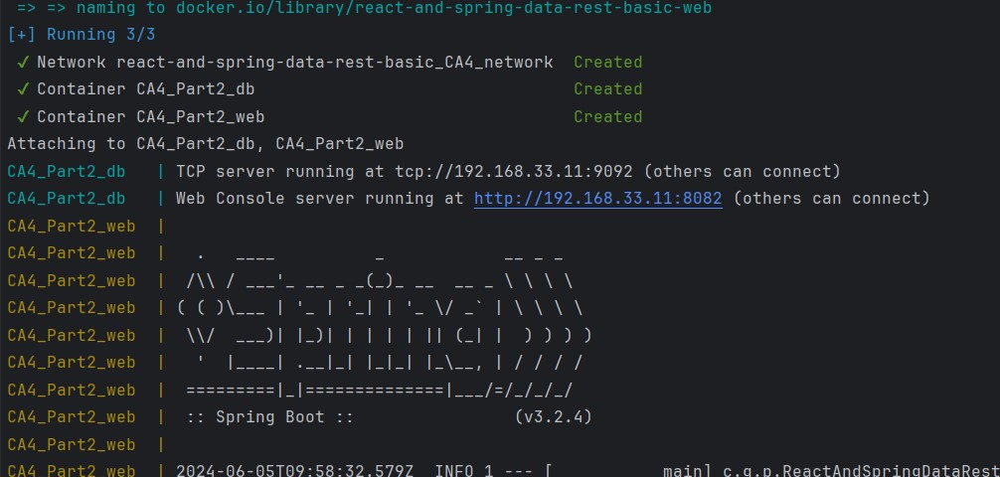
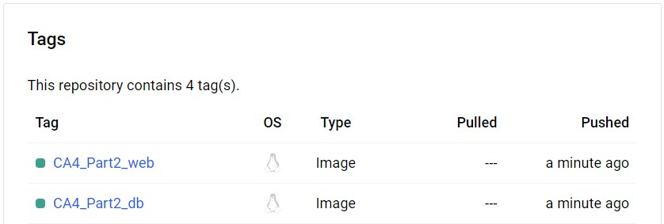

# Class Assignment 4 Part 2 - DEVOPS - Joao Vieira 1231835 SWitCh

## Introduction

For class assignment 4 Part 2 the aim was to use Docker to create two images and run a container with those images.
One image to run the web app and the second one to host an H2 database.


## Table of Contents

2. [Dockerfile](#Dockerfile)
3. [Dockerfile-v2](#Dockerfile-v2)
4. [Docker-compose](#Docker-compose)
5. [Alternative](#Alternative)
6. [Conclusion](#Conclusion)


## Dockerfile

To start the class assignment, the contents of CA2 Part2 were first copied to the same folder as the
dockerfile (CA4/Part2).


Here is the Dockerfile responsible for creating an image that runs the app.
All steps taken are explained within the dockerfile:

```Dockerfile
# Official OpenJDK 17 slim image as the base image.
# This provides the JDK runtime environment required for running Java applications.
FROM openjdk:17-jdk-slim

# Sets the working directory to /app.
# All subsequent commands will be executed from this directory.
WORKDIR /app

# Copies the pre-built JAR file from the local machine to the /app/dist directory in the container.
# This step transfers the compiled Java application into the Docker container.
COPY ./react-and-spring-data-rest-basic/build/libs/react-and-spring-data-rest-basic-0.0.1-SNAPSHOT.jar ./dist/

# Lists the files in the dist directory to verify the JAR file is in place.
# This helps in debugging and ensures the file was copied correctly.
RUN ls -la dist

# Exposes port 8080 to allow external access to the application running inside the container.
# This informs Docker that the container will listen on this network port at runtime.
EXPOSE 8080

# Defines the command to run the JAR file when the container starts.
# This command starts the Java application.
CMD ["java", "-jar", "dist/react-and-spring-data-rest-basic-0.0.1-SNAPSHOT.jar"]
```


## Dockerfile-v2

This Dockerfile (named Dockerfile-v2) is responsible for creating an image that runs the H2 database.
All steps taken are explained within the dockerfile-v2:

```Dockerfile
# Official Ubuntu 20.04 LTS (Focal Fossa) image as the base image.
# This provides a stable and secure operating system environment.
FROM ubuntu:focal

# Updates the package list and install required packages:
# - wget: a utility to download files from the web
# - openjdk-17-jdk-headless: Java Development Kit version 17 without GUI components
# The rm command cleans up the package lists to reduce the image size.
RUN apt-get update && \
  apt-get install -y wget openjdk-17-jdk-headless && \
   rm -rf /var/lib/apt/lists/* \

# Sets the working directory to /opt/h2.
# All subsequent commands will be executed from this directory.
WORKDIR /opt/h2

# Downloads the H2 database JAR file from the Maven repository and renames it to h2.jar.
# This step transfers the H2 database engine into the Docker container.
RUN wget https://repo1.maven.org/maven2/com/h2database/h2/1.4.200/h2-1.4.200.jar -O h2.jar

# Exposes port 8082 for web-based H2 Console access.
# This allows external access to the web interface of the H2 database.
EXPOSE 8082

# Exposes port 9092 for TCP-based H2 database access.
# This allows external applications to connect to the H2 database via TCP.
EXPOSE 9092

# Defines the command to run the H2 database server when the container starts.
# This command starts the H2 database server with specified options:
# -ifNotExists: Only creates a new database if it does not already exist
# -web: Enables the web-based H2 Console
# -webAllowOthers: Allows remote access to the web-based H2 Console
# -webPort: Specifies the port for the web-based H2 Console (8082)
# -tcp: Enables TCP server mode
# -tcpAllowOthers: Allows remote TCP connections
# -tcpPort: Specifies the port for TCP server mode (9092)
CMD ["java", "-cp", "h2.jar", "org.h2.tools.Server", "-ifNotExists", "-web", "-webAllowOthers", "-webPort", "8082", "-tcp", "-tcpAllowOthers", "-tcpPort", "9092"]
```


## Docker-compose

The Docker-compose file creates the two images and runs the containers.
All steps taken are explained within the docker-compose.yml file:

```yaml
# Define the custom network used by the services.
networks:
  CA4_network:
    ipam:
      driver: default
      config:
        - subnet: 192.168.33.0/24

# Define the services that make up the application.
services:
  # Define the database service.
  db:
    # Build the Docker image for the db service.
    build:
      # Specify the context directory for the Docker build.
      context: ..
      # Specify the Dockerfile to use for the build.
      dockerfile: react-and-spring-data-rest-basic/Dockerfile-v2
    # Set the container name for the db service.
    container_name: CA4_Part2_db
    # Map the container ports to the host ports.
    # Expose port 8082 for web-based H2 Console access.
    # Expose port 9092 for TCP-based H2 database access.
    ports:
      - "8082:8082"
      - "9092:9092"
    # Mount a volume to persist data.
    # The volume h2-data is mounted to /opt/h2-data in the container.
    volumes:
      - h2-data:/opt/h2-data
    # Connect the db service to the CA4_network.
    networks:
      CA4_network:
        # Assign a static IP address to the db service within the CA4_network.
        ipv4_address: 192.168.33.11

  # Define the web service.
  web:
    # Build the Docker image for the web service.
    build:
      # Specify the context directory for the Docker build.
      context: ..
      # Specify the Dockerfile to use for the build.
      dockerfile: react-and-spring-data-rest-basic/Dockerfile
    # Set the container name for the web service.
    container_name: CA4_Part2_web
    # Map the container port 8080 to the host port 8080.
    ports:
      - "8080:8080"
    # Connect the web service to the CA4_network.
    networks:
      CA4_network:
        # Assign a static IP address to the web service within the CA4_network.
        ipv4_address: 192.168.33.10
    # Define a dependency on the db service.
    # The web service will wait for the db service to be ready before starting.
    depends_on:
      - "db"

# Define the named volumes used by the services.
volumes:
  # Define the h2-data volume to persist H2 database data.
  h2-data:
    # Use the default local driver for the volume.
    driver: local
```

Now that the docker-compose file is created the images can be built by running the following commands:

```bash
./gradlew build
docker-compose build
docker-compose up
```
Here is an image of both images being successfully created:



Finally, the Web and Database docker images were pushed to Docker Hub by running:

```bash
# Tag the images
docker tag react-and-spring-data-rest-basic-db:latest 1231835/devops_23_24:CA4_Part2_db
docker tag react-and-spring-data-rest-basic-web:latest 1231835/devops_23_24:CA4_Part2_web
docker push 1231835/devops_23_24:CA4_Part2_db
docker push 1231835/devops_23_24:CA4_Part2_web
```

Here is an image of the tags in docker hub:


## Alternative

As an alternative I went over Kubernetes. However, no implementation was made, only a theoretical approach was explored.

To deploy the same setup using Kubernetes, there would be the need to create the necessary Kubernetes resources such as
Deployments, Services, and PersistentVolumeClaims for the H2 database. 
Below are the YAML files required for this implementation.

PersistentVolume and PersistentVolumeClaim for H2 Database:
```yaml
apiVersion: v1
kind: PersistentVolume
metadata:
  name: h2-pv
  namespace: ca4
spec:
  capacity:
    storage: 1Gi
  accessModes:
    - ReadWriteOnce
  hostPath:
    path: /mnt/data/h2
---
apiVersion: v1
kind: PersistentVolumeClaim
metadata:
  name: h2-pvc
  namespace: ca4
spec:
  accessModes:
    - ReadWriteOnce
  resources:
    requests:
      storage: 1Gi
 ```

Deployment and Service for H2 Database:
```yaml
apiVersion: apps/v1
kind: Deployment
metadata:
  name: h2-db
  namespace: ca4
spec:
  replicas: 1
  selector:
    matchLabels:
      app: h2-db
  template:
    metadata:
      labels:
        app: h2-db
    spec:
      containers:
        - name: h2-db
          image: your-dockerhub-username/your-db-image
          ports:
            - containerPort: 8082
            - containerPort: 9092
          volumeMounts:
            - mountPath: /opt/h2-data
              name: h2-storage
      volumes:
        - name: h2-storage
          persistentVolumeClaim:
            claimName: h2-pvc
---
apiVersion: v1
kind: Service
metadata:
  name: h2-service
  namespace: ca4
spec:
  selector:
    app: h2-db
  ports:
    - protocol: TCP
      port: 8082
      targetPort: 8082
    - protocol: TCP
      port: 9092
      targetPort: 9092
```

Deployment and Service for the Web App:
```yaml
apiVersion: apps/v1
kind: Deployment
metadata:
  name: web-app
  namespace: ca4
spec:
  replicas: 1
  selector:
    matchLabels:
      app: web-app
  template:
    metadata:
      labels:
        app: web-app
    spec:
      containers:
        - name: web-app
          image: your-dockerhub-username/your-app-image
          ports:
            - containerPort: 8080
          env:
            - name: DB_HOST
              value: "h2-service"
            - name: DB_PORT
              value: "9092"
---
apiVersion: v1
kind: Service
metadata:
  name: web-service
  namespace: ca4
spec:
  type: NodePort
  selector:
    app: web-app
  ports:
    - protocol: TCP
      port: 8080
      targetPort: 8080
      nodePort: 30080
```
Kubernetes and Docker are both essential tools in the containerization ecosystem,
but they serve different purposes and have distinct functionalities.

Docker is a containerization platform that provides the ability to create and run containers, while Kubernetes is a 
container orchestration platform that provides the ability to manage and scale containers across multiple machines.

This alternative solution deploys the same Docker images using Kubernetes for better scalability and management.
The use of PersistentVolumes ensures that data persists across pod restarts, while Services provide a stable endpoint
for accessing the applications.


## Conclusion

In Class Assignment 4 Part 2, the objective was to use Docker to create two images: one for running a web application
and another for hosting an H2 database. This exercise involved creating Dockerfiles for each service, defining a Docker 
Compose file to orchestrate the containers, and exploring an alternative implementation using Kubernetes.

Overall, the assignment provided valuable hands-on experience with Docker and a glance-over with Kubernetes, demonstrating their roles
in modern application deployment and management.


