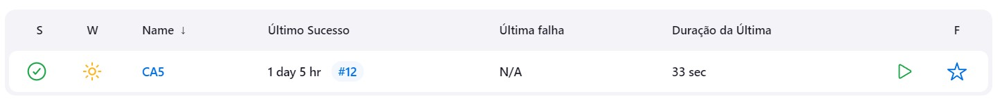
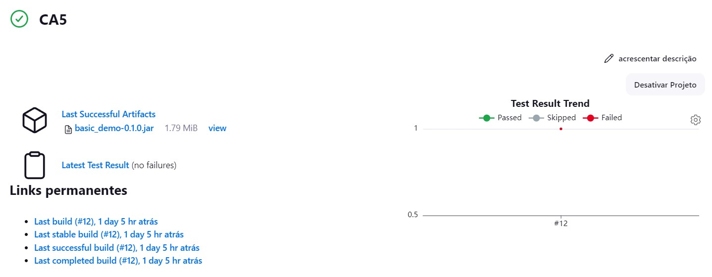
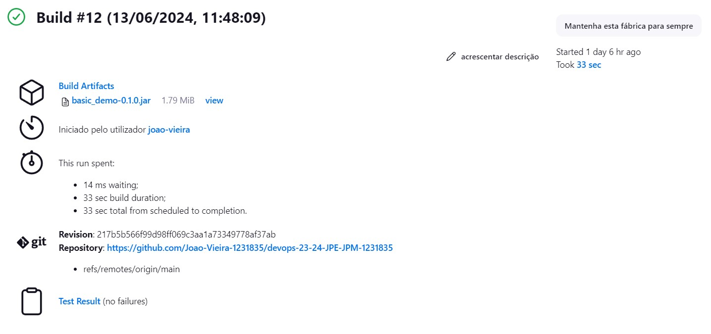
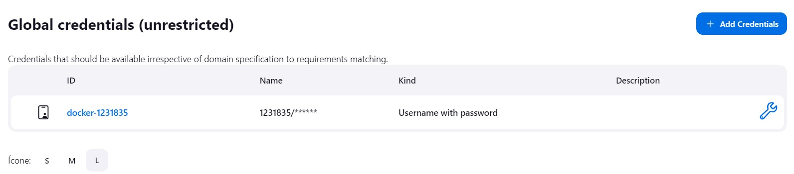
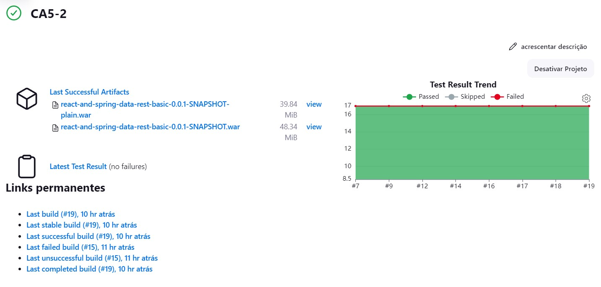
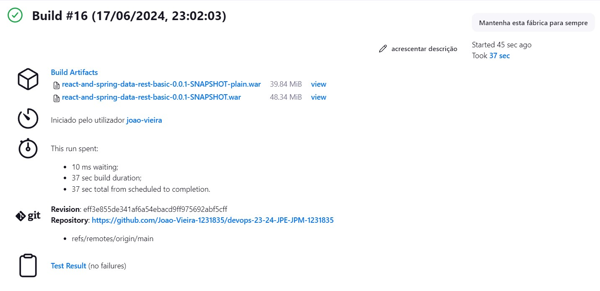
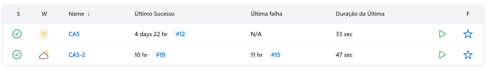

# Class Assignment 5 - DEVOPS - João Vieira 1231835 SWitCH

## Introduction

The goal of this assignment was to create two Jenkins pipelines
that automate the build, test, and deployment of the applications
developed in class assignment CA2.

First, a simple pipeline was created for practice.
Then, a second one was created in order to use Docker
to deploy the application to a container and then publish the container to Docker Hub

The result of the assignment can be found [here](https://github.com/Joao-Vieira-1231835/devops-23-24-JPE-JPM-1231835/tree/main/CA5).

## Table of Contents

1. [Pipeline Practice](#Pipeline-Practice)
2. [Pipeline 2](#Pipeline-2)
3. [Conclusion](#Conclusion)

## Pipeline Practice

### Step 1: Install Jenkins

The First step was to install Jenkins using Docker. This was done following the steps from the [Official Website](https://www.jenkins.io/doc/book/installing/docker/).

### Step 2: Create Jenkins Docker Image

To make this process easier I used a docker-compose file to automate the creation of the service.
In order to do this, firstly, I created a Dockerfile with the following content in a directory on my machine:

```dockerfile
FROM jenkins/jenkins:2.452.2-jdk17
USER root
RUN apt-get update && apt-get install -y lsb-release
RUN curl -fsSLo /usr/share/keyrings/docker-archive-keyring.asc \
  https://download.docker.com/linux/debian/gpg
RUN echo "deb [arch=$(dpkg --print-architecture) \
  signed-by=/usr/share/keyrings/docker-archive-keyring.asc] \
  https://download.docker.com/linux/debian \
  $(lsb_release -cs) stable" > /etc/apt/sources.list.d/docker.list
RUN apt-get update && apt-get install -y docker-ce-cli
USER jenkins
RUN jenkins-plugin-cli --plugins "blueocean docker-workflow"
```

This Dockerfile does the following:

- Base Image: Uses the Jenkins LTS image with JDK 17.

- Install lsb-release: Necessary for determining the codename of the Debian-based system.

- Add Docker Repository: Adds Docker's official GPG key and repository to the sources list.

- Install Docker CLI: Installs Docker CLI to allow Jenkins to communicate with Docker.

- Install Jenkins Plugins: Installs the Blue Ocean and Docker Workflow plugins using the Jenkins plugin CLI.

### Step 3: Run Docker Commands

The following commands were executed in PowerShell to set up the Jenkins environment:

```bash
# Create a Docker network for Jenkins
docker network create jenkins

# Run Docker-in-Docker container
docker run --name jenkins-docker --rm --detach
--privileged --network jenkins --network-alias docker
--env DOCKER_TLS_CERTDIR=/certs
--volume jenkins-docker-certs:/certs/client
--volume jenkins-data:/var/jenkins_home
--publish 2376:2376

# Build the custom Jenkins image
docker build -t myjenkins-blueocean:2.452.2-1 .

# Run the custom Jenkins container
docker run --name jenkins-blueocean --restart=on-failure --detach \
--network jenkins --env DOCKER_HOST=tcp://docker:2376 \
--env DOCKER_CERT_PATH=/certs/client --env DOCKER_TLS_VERIFY=1 \
--publish 8080:8080 --publish 50000:50000 \
--volume jenkins-data:/var/jenkins_home \
--volume jenkins-docker-certs:/certs/client:ro myjenkins-blueocean:2.452.2-1

# Check running containers
docker ps -a

# Check Jenkins logs
docker logs e9a445429394
```
Explanation:

- Create Docker Network: Creates an isolated network for Jenkins containers.
- Run Docker-in-Docker (dind) Container: Starts a Docker container with Docker-in-Docker enabled, which allows Jenkins to run Docker commands inside Docker containers.
- Build Custom Jenkins Image: Builds the custom Jenkins image using the Dockerfile created earlier.
- Run Custom Jenkins Container: Runs the Jenkins container with necessary environment variables and volumes to enable Docker inside Jenkins.

### Step 4: Access Jenkins

At last, Jenkins could be accessed via [localhost 8080](http://localhost:8080) and finalize the 
[post-installation setup wizard](https://www.jenkins.io/doc/book/installing/docker/#setup-wizard) with the key
that the above-mentioned commands provided.

### Step 5: Create Jenkins Pipeline

A Jenkinsfile was created to define the pipeline and the steps it would execute:


```groovy
pipeline {
   agent any
   stages {
      stage ('Checkout') {
         steps {
            echo 'Checking out...'
            git branch: 'main', url: 'https://github.com/Joao-Vieira-1231835/devops-23-24-JPE-JPM-1231835.git'
         }
      }
      stage('Prepare') {
         steps {
            echo 'Setting executable permissions for gradlew...'
            script {
               if (isUnix()) {
                  dir('CA2/Part1') {
                     sh 'chmod +x gradlew'
                  }
               } else {
                  echo 'Skipping chmod on Windows'
               }
            }
         }
      }
      stage ('Assemble') {
         steps {
            echo 'Assembling CA2/Part1 project...'
            script {
               if (isUnix()) {
                  dir ('CA2/Part1') {
                     sh 'ls -la'
                     sh './gradlew assemble'
                  }
               } else {
                  dir ('CA2/Part1') {
                     bat 'gradlew.bat clean'
                     bat 'gradlew.bat assemble'
                  }
               }
            }
         }
      }
      stage ('Test') {
         steps {
            echo 'Running tests...'
            script {
               if (isUnix()) {
                  dir('CA2/Part1') {
                     sh './gradlew test'
                  }
               } else {
                  dir('CA2/Part1') {
                     bat 'gradlew.bat test'
                  }
               }
            }
         }
         post {
            always {
               echo 'Publishing test results...'
               junit 'CA2/Part1/build/test-results/test/*.xml'
            }
         }
      }
      stage ('Archiving') {
         steps {
            echo 'Archiving...'
            archiveArtifacts 'CA2/Part1/build/libs/*.jar'
         }
      }
   }
}
```

Explanation:

- Pipeline: Defines a Jenkins pipeline.
- Agent: Specifies that the pipeline should run on any available agent.
- Stages: Defines the stages of the pipeline.
- Checkout: Checks out the code from the GitHub repository.
- Prepare: Sets executable permissions for gradlew.
- Assemble: Assembles the project using gradlew.
- Test: Runs tests using gradlew and publishes the test results.
- Archiving: Archives the built .jar files.

### Step 6: Run the Pipeline

Finally, there was the need push this file to the online repository and to run the Pipeline in Jenkins
by clicking the 'Build Now' button (after creating and setting up a new pipeline job)

Here are the two images that show that the build was successful in Jenkins:







## Pipeline 2

The second pipeline is similar to the first one but with an additional stage
that deploys the application to a Docker container and then publishes the
container to Docker Hub. 

### Step 1: Create Dockerfile

In order to deploy the application to a Docker container I created a Dockerfile in the CA5 directory:

```bash
FROM tomcat:10.1.24-jdk17-temurin-jammy
LABEL authors="joaoa"

# Remove the default ROOT webapp in order to avoid problems
RUN rm -rf /usr/local/tomcat/webapps/ROOT

# Copy the WAR file from the CA2 to the webapps directory
COPY ./*.war /usr/local/tomcat/webapps/

# Expose port 8080
EXPOSE 8080

# Start Tomcat
CMD ["catalina.sh", "run"]
```

Explanation:

- Base Image: Uses the official Tomcat image with JDK 17.
- Remove Default Webapp: Removes the default ROOT web application to avoid conflicts.
- Copy WAR File: Copies the built WAR file to the Tomcat webapps directory.
- Expose Port: Exposes port 8080 to access the application.
- Start Tomcat: Starts the Tomcat server.

### Step 2: Create Jenkinsfile for the Pipeline

Then, I created the Jenkinsfile for the second pipeline as follows:

```groovy
pipeline {
   agent any
   stages {
      stage ('Checkout') {
         steps {
            echo 'Checking out...'
            git branch: 'main', url: 'https://github.com/Joao-Vieira-1231835/devops-23-24-JPE-JPM-1231835.git'
         }
      }
      stage('Prepare') {
         steps {
            echo 'Setting executable permissions for gradlew...'
            script {
               if (isUnix()) {
                  dir('CA2/Part2/react-and-spring-data-rest-basic') {
                     sh 'chmod +x gradlew'
                  }
               } else {
                  echo 'Skipping chmod on Windows'
               }
            }
         }
      }
      stage ('Assemble') {
         steps {
            echo 'Assembling CA2/Part2/react-and-spring-data-rest-basic project...'
            script {
               if (isUnix()) {
                  dir ('CA2/Part2/react-and-spring-data-rest-basic') {
                     sh './gradlew clean'
                     sh './gradlew assemble'
                  }
               } else {
                  dir ('CA2/Part2/react-and-spring-data-rest-basic') {
                     bat 'gradlew.bat clean'
                     bat 'gradlew.bat assemble'
                  }
               }
            }
         }
      }
      stage ('Test') {
         steps {
            echo 'Running tests...'
            script {
               if (isUnix()) {
                  dir('CA2/Part2/react-and-spring-data-rest-basic') {
                     sh './gradlew test'
                  }
               } else {
                  dir('CA2/Part2/react-and-spring-data-rest-basic') {
                     bat 'gradlew.bat test'
                  }
               }
            }
         }
         post {
            always {
               echo 'Publishing test results...'
               junit 'CA2/Part2/react-and-spring-data-rest-basic/build/test-results/test/*.xml'
            }
         }
      }
      stage ('Javadoc') {
         steps {
            echo 'Generating Javadoc...'
            script {
               if (isUnix()) {
                  dir('CA2/Part2/react-and-spring-data-rest-basic') {
                     sh './gradlew javadoc'
                  }
               } else {
                  dir('CA2/Part2/react-and-spring-data-rest-basic') {
                     bat 'gradlew.bat javadoc'
                  }
               }
            }
            echo 'Archiving and publishing Javadoc...'
            publishHTML(target: [allowMissing: false,
                                 alwaysLinkToLastBuild: false,
                                 keepAll: true,
                                 reportDir: '/var/jenkins_home/workspace/CA5-2/CA2/Part2/react-and-spring-data-rest-basic/build/docs/javadoc',
                                 reportFiles: 'index.html',
                                 reportName: 'Javadoc Report'])
         }
      }
      stage ('Archiving') {
         steps {
            echo 'Archiving...'
            archiveArtifacts 'CA2/Part2/react-and-spring-data-rest-basic/build/libs/*.war'
         }
      }
      stage('Docker') {
         steps {
            script {
               echo 'Building and publishing Docker image...'
               def dockerImage = docker.build("1231835/devops_23_24:${env.BUILD_ID}", "-f ./CA5/Jenkins2/Dockerfile .")
               docker.withRegistry('https://index.docker.io/v1/', 'docker-1231835') {
                  dockerImage.push()
               }
            }
         }
      }
   }
}
```

Explanation:

- This Jenkinsfile is similar to the first one but includes an additional stage, Docker, which builds and publishes the Docker image.
- Docker: Builds the Docker image using the specified Dockerfile and pushes it to Docker Hub.

### Step 3: Start Docker-in-Docker (dind) Container

To enable Docker inside Jenkins, there was the need to start Docker-in-Docker (dind) container, and to stop, remove,
and update docker jenkins-blueocean. These were the steps taken:

```bash
# Start Docker-in-Docker container
docker run --name jenkins-docker --rm --detach
--privileged --network jenkins --network-alias docker
--env DOCKER_TLS_CERTDIR=/certs
--volume jenkins-docker-certs:/certs/client
--volume jenkins-data:/var/jenkins_home
--publish 2376:2376 docker:dind

# Stop Jenkins Blue Ocean container
docker stop jenkins-blueocean

# Remove Jenkins Blue Ocean container
docker rm jenkins-blueocean

# Run Jenkins Blue Ocean container
docker run --name jenkins-blueocean
--restart=on-failure --detach
--network Jenkins
--env DOCKER_HOST=tcp://172.18.0.3:2376
--env DOCKER_CERT_PATH=/certs/cliente
--env DOCKER_TLS_VERIFY=1
--publish 8080:8080
--publish 50000:50000
--volume jenkins-data:/var/jenkins_home
--volume jenkins-docker-certs:/certs/client:ro myjenkins-blueocean:2.452.2-1
```
Explanation:

- Start Docker-in-Docker Container: Starts a Docker container with Docker-in-Docker enabled.
- Stop and Remove Jenkins Blue Ocean Container: Stops and removes the existing Jenkins Blue Ocean container.
- Run Jenkins Blue Ocean Container: Runs the updated Jenkins Blue Ocean container with necessary environment variables and volumes.

### Step 4: Run second the Pipeline


Finally, the Dockerfile and Jenkinsfile were pushed to the online repository, the credentials for docker in Jenkins were set,
and the build was successful

The following images show that docker credentials were set in Jenkins, and that the build was successful:







## Conclusion

In this assignment, I successfully created two Jenkins pipelines to automate the build, test, and deploy processes
for an app developed in a previous class assignment. The first pipeline served as an introductory exercise, while the
second pipeline integrated Docker to deploy the application to a container and publish it to Docker Hub.

The successful execution of both pipelines demonstrates the ability to automate CI/CD processes. The results of this work,
including the Jenkinsfiles and Docker configurations, can be found in this GitHub repository [link](https://github.com/Joao-Vieira-1231835/devops-23-24-JPE-JPM-1231835/tree/main/CA5).

Overall, this assignment enhanced my understanding of Jenkins, Docker, and continuous integration and deployment
practices, preparing me for more complex DevOps tasks in the future.


